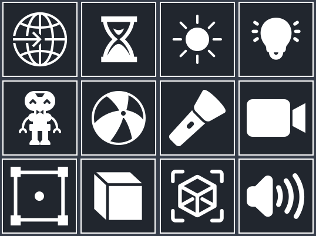

# Godot Quick 3D Toolbar

## About
Quick toolbar is a simple plugin for Godot that allows you to quickly create 3D nodes in your projects using a shortcut bar.

## How to install
Copy "quick_toolbar" folder inside the "addons" folder of your Godot project and activate the plugin in the project settings.

## How to use it
Just click on the node icon to instantiate it in the current scene.

